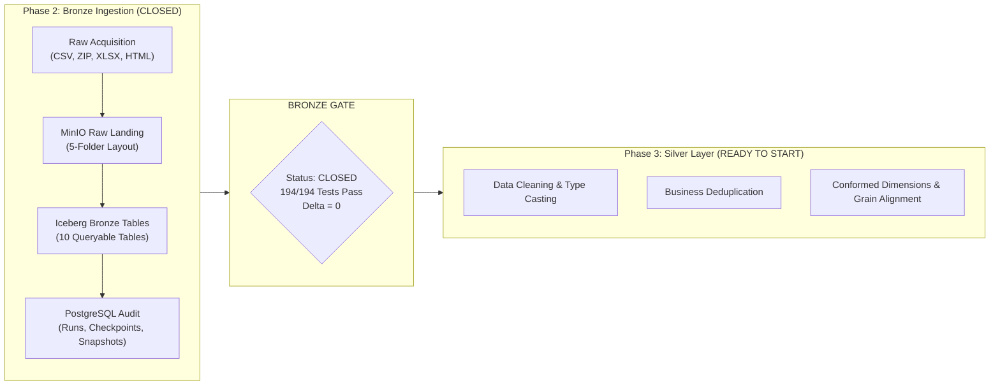
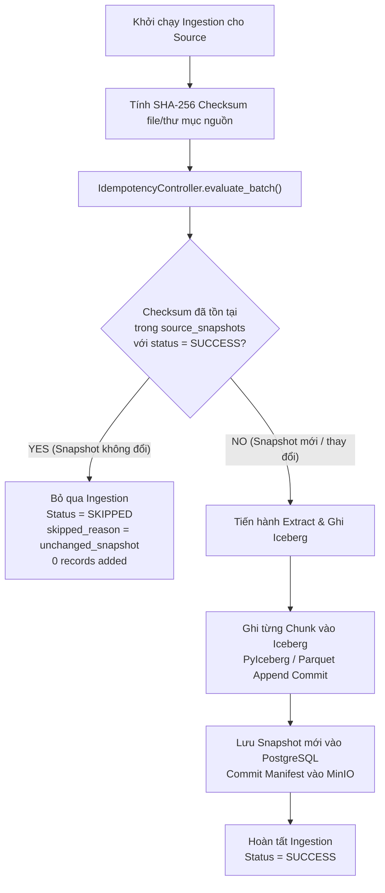
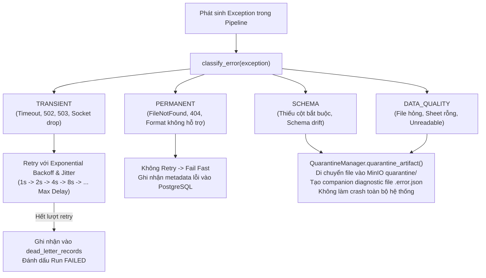
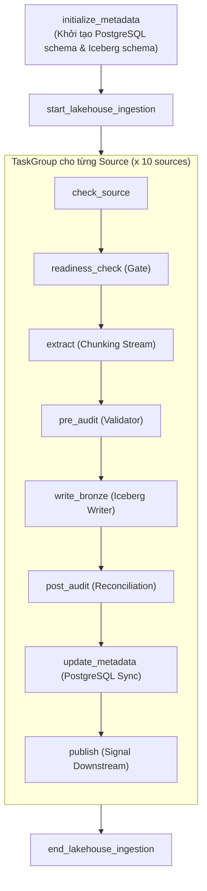
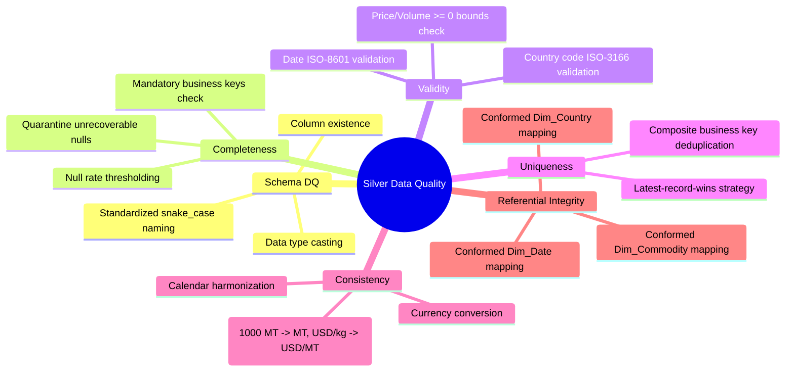

# BÁO CÁO ĐÓNG BĂNG VÀ BÀN GIAO TẦNG BRONZE (BRONZE CLOSURE & HANDOFF SPECIFICATION)

> **Dự án:** Xây dựng Data Lakehouse phục vụ phân tích và dự báo thị trường lúa gạo Việt Nam  
> **Workspace:** `C:\Windows_Application\TLCN`  
> **Giai đoạn:** Phase 2 — Bronze Ingestion (Final Baseline Freeze)  
> **Trạng thái Gate:** **BRONZE = CLOSED (PASS)**  
> **Ngày phê duyệt:** 26/09/2026  

---

## 1. EXECUTIVE SUMMARY (TỔNG QUAN ĐIỀU HÀNH)

Giai đoạn **Phase 2 — Bronze Ingestion** đã chính thức hoàn thành, vượt qua toàn bộ các bài kiểm tra tích hợp E2E thực tế trên hạ tầng Lakehouse cục bộ (MinIO, Apache Iceberg REST Catalog, Trino SQL Query Engine, Apache Airflow Orchestration, PostgreSQL Ingestion Metadata).

### Các kết quả then chốt đã xác minh:
1. **9 Canonical Sources Đóng Băng:** 100% các nguồn dữ liệu gạo canonical đã được ingestion thành công vào Bronze Iceberg tables.
2. **Khối lượng lớn `faostat_trade` đạt chuẩn tuyệt đối:**
   - **Raw Input Records:** `1,226,470`
   - **Adapter Extracted Records:** `1,226,470`
   - **Bronze Iceberg Rows:** `1,226,470`
   - **Trino SQL Query Count:** `1,226,470`
   - **Delta / Data Loss:** `0` (Không thất thoát bất kỳ dòng dữ liệu nào).
3. **Tính Bất Biến & Idempotency Tuyệt Đối:** Cơ chế đối soát SHA-256 checksum snapshot và batch metadata đảm bảo chạy lại nhiều lần sinh ra `0 duplicate rows` (trạng thái `SKIPPED`).
4. **Khả Năng Phục Hồi Checkpoint / Resume:** Phục hồi dòng chảy chính xác từ chunk bị gián đoạn, tự động dọn dẹp checkpoint khi hoàn tất.
5. **Cơ Chế Phân Loại & Cách Ly Lỗi (Reliability & Quarantine):** 4 nhóm ngoại lệ (`TRANSIENT`, `PERMANENT`, `SCHEMA`, `DATA_QUALITY`) được xử lý triệt để với retry exponential backoff và chuyển file lỗi vào vùng `quarantine` kèm file chẩn đoán `.error.json`.
6. **Điều Phối Tự Động Hóa Airflow:** DAG `rice_lakehouse_ingestion` gồm 83 tasks cấu trúc theo chu trình 8 giai đoạn khép kín (`check_source` $\to$ `readiness_check` $\to$ `extract` $\to$ `pre_audit` $\to$ `write_bronze` $\to$ `post_audit` $\to$ `update_metadata` $\to$ `publish`), kiểm tra DAG 0 lỗi import.
7. **Toàn Bộ Test Suite Xanh 100%:** `194 passed`, `0 failed`, `0 errors` trên toàn bộ unit và integration test suite.



---

## 2. CANONICAL SOURCE INVENTORY (DANH MỤC NGUỒN DỮ LIỆU ĐÓNG BĂNG)

Danh mục 9 nguồn dữ liệu canonical sản xuất được đóng băng như sau:

| STT | Canonical Source ID | Provider | Dataset / Tên tập dữ liệu | Định dạng tệp | Runtime Source Type | Trạng thái |
| :---: | :--- | :--- | :--- | :---: | :---: | :---: |
| 1 | `faostat_production` | FAOSTAT | Production Crops and Livestock World (Normalized) | CSV | `LOCAL_FILE` | **PRODUCTION** |
| 2 | `faostat_monthly_price` | FAOSTAT | Producer Prices Monthly (Normalized) | CSV | `LOCAL_FILE` | **PRODUCTION** |
| 3 | `faostat_trade` | FAOSTAT | Detailed Trade Matrix (Normalized) | CSV | `LOCAL_FILE` | **PRODUCTION** |
| 4 | `faostat_supply_utilization` | FAOSTAT | Supply Utilization Accounts (SUA Crops) | CSV | `LOCAL_FILE` | **PRODUCTION** |
| 5 | `nso_vietnam` | GSO Vietnam | V06 Rice Statistics (13 Annual CSVs: 2012–2024) | CSV (Multi-file) | `LOCAL_FILE` | **PRODUCTION** |
| 6 | `usda_rice_yearbook` | USDA ERS | Rice Yearbook (Export Price Quotes) | CSV | `LOCAL_FILE` | **PRODUCTION** |
| 7 | `usda_psd` | USDA FAS | Production, Supply & Distribution (PSD Grains) | HTML Table (.xls) | `LOCAL_FILE` | **PRODUCTION** |
| 8 | `worldbank_pinksheet` | World Bank | Commodity Markets Pink Sheet (Monthly) | XLSX | `LOCAL_FILE` | **PRODUCTION** |
| 9 | `thitruongnongsan` | IPSARD | Daily Rice Market Prices (Giá lúa gạo nội địa) | XLSX | `LOCAL_FILE` | **PRODUCTION** |

### Phân biệt rõ Validation Fixtures và Aliases:
- **`faostat_trade_validation`**: Là validation fixture thu nhỏ (2,000 dòng trích xuất từ Trade Matrix ZIP) dùng để chạy integration test nhanh, **KHÔNG PHẢI** là canonical production source.
- **Aliases được hỗ trợ trong Registry**:
  - `faostat_price` $\to$ alias của `faostat_monthly_price`
  - `faostat_sua` $\to$ alias của `faostat_supply_utilization`
  - `usda_export_prices` $\to$ alias của `usda_rice_yearbook`
  - `nso_gso` $\to$ alias của `nso_vietnam`

---

## 3. INGESTION STRATEGY MATRIX (MA TRẬN CHIẾN LƯỢC NẠP DỮ LIỆU)

Tất cả 9 nguồn canonical phản ánh chính xác kiến trúc code thực tế trong `src/ingestion/`:

| Source ID | Đường dẫn Input thô | Chiến lược nạp | Cơ chế Tăng dần / Cập nhật | Kiểm soát Idempotency | Cơ chế Checkpoint | Xử lý Lỗi & Retry |
| :--- | :--- | :---: | :--- | :--- | :--- | :--- |
| `faostat_production` | `data/raw/faostat/production_world.csv` | **FULL** | Snapshot Replaced khi Checksum SHA-256 đổi | SHA-256 artifact hash match $\to$ `SKIPPED` | Streaming chunks (50k rows), clear on complete | Retry 5 lần (Exp Backoff, Max 120s) |
| `faostat_monthly_price` | `data/raw/faostat/price.csv` | **FULL** | Snapshot Replaced khi Checksum SHA-256 đổi | SHA-256 artifact hash match $\to$ `SKIPPED` | Streaming chunks (50k rows), clear on complete | Retry 5 lần (Exp Backoff, Max 120s) |
| `faostat_trade` | `data/raw/faostat/Trade_DetailedTradeMatrix_E_All_Data_(Normalized)/rice_trade_data.csv` | **FULL** | Snapshot Replaced khi Checksum SHA-256 đổi (Historical Rev) | SHA-256 artifact hash match $\to$ `SKIPPED` | 25 Chunks $\times$ 50k rows; Row-level resume | Retry 5 lần (Exp Backoff, Max 120s) |
| `faostat_supply_utilization` | `data/raw/faostat/supply_utilization.csv` | **FULL** | Snapshot Replaced khi Checksum SHA-256 đổi | SHA-256 artifact hash match $\to$ `SKIPPED` | Streaming chunks (50k rows), clear on complete | Retry 5 lần (Exp Backoff, Max 120s) |
| `nso_vietnam` | `data/raw/nso/` (Thư mục 13 file) | **FULL / DIR** | File-arrival incremental: Bỏ qua file đã ingest dựa trên `_source_file` | Checksum SHA-256 thư mục + Tập tên file đã ingest | Per-file transaction commitment | Retry 3 lần; Schema drift quarantine |
| `usda_rice_yearbook` | `data/raw/usda/Export-prices-Thailand-Vietnam-India-and-Pakistan.csv` | **FULL** | Snapshot Replaced khi Checksum SHA-256 đổi | SHA-256 artifact hash match $\to$ `SKIPPED` | Streaming chunks (50k rows), clear on complete | Retry 5 lần (Exp Backoff, Max 120s) |
| `usda_psd` | `data/raw/usda/usda.xls` (HTML masquerade) | **FULL** | Snapshot Replaced khi Checksum SHA-256 đổi | SHA-256 artifact hash match $\to$ `SKIPPED` | Single atomic chunk transaction | Retry 5 lần (Exp Backoff, Max 120s) |
| `worldbank_pinksheet` | `data/raw/world_bank/CMO-Historical-Data-Monthly.xlsx` | **FULL** | Snapshot Replaced khi Checksum SHA-256 đổi | SHA-256 artifact hash match $\to$ `SKIPPED` | Excel sheet parser transaction | Retry 5 lần (Exp Backoff, Max 120s) |
| `thitruongnongsan` | `data/raw/thitruongnongsan/price_luagao.xlsx` | **FULL** | Snapshot Replaced khi Checksum SHA-256 đổi | SHA-256 artifact hash match $\to$ `SKIPPED` | Excel sheet parser transaction | Retry 5 lần (Exp Backoff, Max 120s) |

> [!IMPORTANT]
> **Nguyên tắc thiết kế Load Strategy:** Tuyệt đối không giả định `year > max(year)` để ép các nguồn quốc tế thành incremental. Do các tổ chức như FAOSTAT, World Bank, USDA thường xuyên điều chỉnh dữ liệu lịch sử (historical revisions), việc áp dụng **Snapshot-Level Full Ingestion kết hợp SHA-256 Checksum** là giải pháp tối ưu, đảm bảo độ chính xác dữ liệu 100% mà không gây lãng phí tài nguyên tính toán.

---

## 4. BRONZE TABLE INVENTORY (DANH MỤC BẢNG ICEBERG BRONZE)

Dữ liệu đã được tạo lập đầy đủ trên catalog `iceberg.bronze`, có thể truy vấn trực tiếp qua Trino:

| Canonical Source | Tên Bảng Iceberg | Source Grain (Hạt dữ liệu) | Cột thô gốc | Cột kỹ thuật | Tổng số cột | Row Count thực tế | Trino Queryable |
| :--- | :--- | :--- | :---: | :---: | :---: | :---: | :---: |
| `faostat_production` | `iceberg.bronze.faostat_production` | Quốc gia $\times$ Hàng hóa $\times$ Yếu tố $\times$ Năm | 15 | 7 | 22 | **22,738** | `PASSED` |
| `faostat_monthly_price` | `iceberg.bronze.faostat_monthly_price` | Quốc gia $\times$ Hàng hóa $\times$ Tháng $\times$ Năm | 16 | 7 | 23 | **15,334** | `PASSED` |
| `faostat_trade` | `iceberg.bronze.faostat_trade` | Nước xuất $\times$ Nước nhập $\times$ Hàng hóa $\times$ Yếu tố $\times$ Năm | 16 | 7 | 23 | **1,226,470** | `PASSED` |
| `faostat_supply_utilization` | `iceberg.bronze.faostat_supply_utilization` | Quốc gia $\times$ Hàng hóa $\times$ Yếu tố $\times$ Năm | 15 | 7 | 22 | **36,380** | `PASSED` |
| `nso_vietnam` | `iceberg.bronze.nso_vietnam` | Tỉnh/Thành $\times$ Chỉ tiêu $\times$ Năm/Vụ mùa | 41 | 7 | 48 | **833** | `PASSED` |
| `usda_rice_yearbook` | `iceberg.bronze.usda_rice_yearbook` | Bảng $\times$ Thị trường/Chủng loại $\times$ Kỳ/Năm | 10 | 7 | 17 | **13,131** | `PASSED` |
| `usda_psd` | `iceberg.bronze.usda_psd` | Quốc gia $\times$ Chỉ tiêu PSD $\times$ Niên vụ | 71 | 7 | 78 | **15** | `PASSED` |
| `worldbank_pinksheet` | `iceberg.bronze.worldbank_pinksheet` | Tháng (YYYY-MM) $\times$ Danh mục hàng hóa | 90 | 7 | 97 | **792** | `PASSED` |
| `thitruongnongsan` | `iceberg.bronze.thitruongnongsan` | Mặt hàng $\times$ Thị trường $\times$ Ngày | 8 | 7 | 15 | **20,394** | `PASSED` |
| *(Validation fixture)* | `iceberg.bronze.faostat_trade_validation` | Validation slice | 16 | 7 | 23 | 2,000 | `PASSED` |

---

## 5. BRONZE SEMANTICS (NGUYÊN TẮC NGHIỆP VỤ TẦNG BRONZE)

### 5.1. Nguyên tắc cốt lõi (Bronze Invariant Rules):
1. **Preserve Source Semantics & Values:** Dữ liệu thô từ nguồn gốc được giữ nguyên giá trị (kể cả khoảng trắng, ký tự đặc biệt, giá trị âm hoặc null).
2. **Preserve Source Structure:** Schema của bảng thô phản ánh đúng cấu trúc file nguồn sau khi sanitize tên cột cho tương thích chuẩn SQL.
3. **Preserve Source Lineage & Artifact:** Mọi artifact tải về đều được lưu nguyên vẹn vào MinIO Raw Landing.
4. **Append-Only & Replayable:** Tầng Bronze hỗ trợ replay hoặc backfill toàn diện bất kỳ lúc nào từ Raw Landing hoặc file thô gốc.
5. **No Business Transformation:** Tuyệt đối **KHÔNG** thực hiện tính toán KPI, không tính tổng/trung bình, không join bảng nghiệp vụ, không deduplicate dữ liệu nghiệp vụ, không feature engineering ở tầng Bronze.

### 5.2. Chuẩn hóa 7 Cột Metadata Kỹ thuật (Technical Metadata Columns):
Mọi bản ghi ghi vào Iceberg Bronze đều được bổ sung đồng nhất 7 cột kỹ thuật:

```text
1. _ingestion_run_id       : VARCHAR                     (Mã định danh lần chạy pipeline, vd: faostat_trade_20260926_...)
2. _ingestion_batch_id     : VARCHAR                     (Mã định danh batch xử lý phục vụ kiểm soát idempotency)
3. _ingestion_timestamp    : TIMESTAMP(6) WITH TIME ZONE (Thời điểm UTC bản ghi được ghi nhận vào Lakehouse)
4. _source_id              : VARCHAR                     (Mã canonical source, vd: faostat_trade, nso_vietnam)
5. _source_file            : VARCHAR                     (Tên file nguồn vật lý, vd: V06.12.csv, rice_trade_data.csv)
6. _source_checksum        : VARCHAR                     (Mã băm SHA-256 của file nguồn gốc)
7. _source_snapshot_id     : BIGINT                      (ID tham chiếu đến bảng metadata ingestion.source_snapshots)
```

---

## 6. IDEMPOTENCY ARCHITECTURE (KIẾN TRÚC BẢO ĐẢM TÍNH IDEMPOTENT)

Hệ thống bảo đảm 3 cấp độ Idempotency để đạt mục tiêu **Zero-Duplicate Ingestion**:



1. **Snapshot-Level Idempotency:** Trước khi trích xuất dữ liệu, `IdempotencyController` kiểm tra mã băm SHA-256 của artifact đối chiếu với bảng `ingestion.source_snapshots`. Nếu artifact không có sự thay đổi nội dung, pipeline trả về ngay trạng thái `SKIPPED` với lý do `unchanged_snapshot`.
2. **Run & Batch Isolation:** Mỗi lần thực thi được phân định bằng một `run_id` và `batch_id` duy nhất, giúp cô lập metadata giữa các phiên chạy đồng thời hoặc chạy lại.
3. **Resume Idempotency:** Trong trường hợp pipeline bị sự cố giữa chừng, khi khởi động lại (resume), `FullLoader` đọc checkpoint từ PostgreSQL để bắt đầu trích xuất từ dòng `last_ckpt.row_end + 1`, không đọc lại hay ghi đè các chunk đã ghi thành công trước đó.

---

## 7. CHECKPOINT & RECOVERY (KIẾN TRÚC PHỤC HỒI ĐIỂM KIỂM SOÁT)

- **Vị trí lưu trữ Checkpoint:** Bảng quan hệ `ingestion.ingestion_checkpoints` trong PostgreSQL (`INGESTION_DB_URL`).
- **Ý nghĩa Checkpoint:** Đại diện cho trạng thái giao dịch của từng phân đoạn (`chunk_id`) trong một phiên chạy (`run_id` và `batch_id`).
- **Cấu trúc trường Checkpoint:**
  - `source_id`, `run_id`, `batch_id`, `chunk_id`
  - `row_start`, `row_end` (khoảng chỉ mục dòng thực tế trong file nguồn)
  - `status` (`SUCCESS`, `FAILED`, `PENDING`)
  - `checksum` (SHA-256 của chunk dữ liệu)
- **Quy trình Resume:**
  ```text
  Run 1 (Fails at Chunk 1):
    - Chunk 0: [0..49,999]     --> Iceberg Commited --> Checkpoint status = SUCCESS
    - Chunk 1: [50,000..99,999] --> Connection Failed --> Checkpoint status = FAILED
  
  Run 2 (Resume from Run 1):
    - Query last successful checkpoint --> Chunk 0 (row_end = 49,999)
    - Resume row offset = 50,000
    - Trích xuất tiếp từ Chunk 1, không ghi đè Chunk 0
    - Kết quả: Không mất dữ liệu, không nhân bản bản ghi
  ```
- **Hợp đồng Dọn dẹp Checkpoint (Clear on Success):** Sau khi toàn bộ các chunks của batch được ghi nhận thành công 100% vào Iceberg, hàm `checkpoint_store.clear(source_id, run_id)` tự động xóa sạch các bản ghi checkpoint tạm để giải phóng tài nguyên database.

---

## 8. ERROR MANAGEMENT & RELIABILITY (QUẢN TRỊ VÀ CÔ LẬP LỖI)

Hệ thống triển khai mô hình phân loại lỗi chuẩn hóa (**Ingestion Exception Hierarchy**):



### Chi tiết phân loại:
1. **Transient Error (`TRANSIENT`):** Sự cố mạng tạm thời, Trino connection reset, MinIO 503/504. Cơ chế: Retry tự động theo cấu hình `RetryConfig` (lên đến 5 lần, exponential backoff và random jitter).
2. **Permanent Error (`PERMANENT`):** Thiếu file nguồn vật lý, URL trả về 404/401/403, định dạng tệp không được hỗ trợ. Cơ chế: Dừng ngay (fail-fast), không retry vô ích, ghi nhật ký lỗi chi tiết.
3. **Schema Error (`SCHEMA`):** Thiếu các cột bắt buộc đã khai báo trong contract (`expected_columns`). Cơ chế: Cô lập file vào vùng `quarantine` và ghi nhận `dead_letter_records`.
4. **Data Quality Error (`DATA_QUALITY`):** Tệp Excel bị hỏng không mở được, CSV lỗi phân mảnh không thể parse, sheet chỉ định không tồn tại. Cơ chế: Gửi cảnh báo, cô lập artifact vào `quarantine` kèm file JSON chẩn đoán.

---

## 9. RAW LANDING & STORAGE LAYOUT (KIẾN TRÚC LƯU TRỮ VÙNG ĐỆM THÔ)

### 9.1. Luồng di chuyển dữ liệu thô:
```text
Local Raw Artifact (data/raw/...) 
       ↓ 
MinIO Raw Landing (s3://bronze/{group}/raw/{batch_id}/{filename}) 
       ↓ 
Bronze Iceberg Table (iceberg.bronze.{source_id})
```

### 9.2. Cấu trúc 5 thư mục chức năng trên MinIO:
Mọi tệp tin được phân nhóm tự động vào 5 phân vùng tiêu chuẩn trong bucket `bronze`:
- `{source_group}/raw/` : Lưu trữ artifact gốc không bị sửa đổi (kể cả ZIP, XLSX, CSV).
- `{source_group}/metadata/` : Lưu trữ `batch_{batch_id}.json` mô tả kích thước, checksum và trạng thái batch.
- `{source_group}/manifest/` : Lưu trữ `run_{run_id}.json` chứa thông tin chi tiết về timing và cấu hình lần chạy.
- `{source_group}/audit/` : Lưu trữ `audit_{run_id}.json` phục vụ kiểm toán đối soát.
- `{source_group}/quarantine/` : Lưu trữ các file dữ liệu lỗi bị cô lập cùng companion file `{filename}.error.json`.

---

## 10. AIRFLOW ORCHESTRATION ARCHITECTURE (ĐIỀU PHỐI AIRFLOW)

DAG `rice_lakehouse_ingestion` được thiết kế theo tiêu chuẩn Enterprise với 83 tasks độc lập:



### Đặc tính kỹ thuật của DAG:
- **DAG ID:** `rice_lakehouse_ingestion`
- **Tổng số tasks:** `83` tasks (8 stages $\times$ 10 sources + 3 control operators `initialize_metadata`, `start_lakehouse_ingestion`, `end_lakehouse_ingestion`).
- **DAG Integrity:** 0 lỗi import (`errors: {}`), đã được kiểm chứng trực tiếp trong container `airflow-scheduler`.
- **Failure Isolation:** Sự cố tại 1 source chỉ làm task của source đó failed, không làm gián đoạn hay ảnh hưởng đến tiến trình nạp của 9 source còn lại.

---

## 11. BRONZE RECONCILIATION BASELINE (ĐỐI SOÁT ĐỊNH LƯỢNG CHÍNH THỨC)

Bảng đối soát đối chiếu định lượng cuối cùng của tầng Bronze:

| Source ID | Physical Input Rows / Format | Logical Source Records | Extracted Records | Iceberg Bronze Rows | Trino Direct SQL Count | Delta | Trạng thái đối soát |
| :--- | :--- | :---: | :---: | :---: | :---: | :---: | :---: |
| `faostat_production` | 22,738 (CSV) | 22,738 | 22,738 | 22,738 | 22,738 | **0** | **MATCHED (100%)** |
| `faostat_monthly_price` | 15,334 (CSV) | 15,334 | 15,334 | 15,334 | 15,334 | **0** | **MATCHED (100%)** |
| `faostat_trade` | 1,226,470 (CSV) | 1,226,470 | 1,226,470 | 1,226,470 | 1,226,470 | **0** | **MATCHED (100%)** |
| `faostat_supply_utilization`| 36,380 (CSV) | 36,380 | 36,380 | 36,380 | 36,380 | **0** | **MATCHED (100%)** |
| `nso_vietnam` | 833 (13 CSV files) | 833 | 833 | 833 | 833 | **0** | **MATCHED (100%)** |
| `usda_rice_yearbook` | 13,131 (CSV) | 13,131 | 13,131 | 13,131 | 13,131 | **0** | **MATCHED (100%)** |
| `usda_psd` | 15 (HTML masquerade) | 15 | 15 | 15 | 15 | **0** | **MATCHED (100%)** |
| `worldbank_pinksheet` | 792 (XLSX Monthly Prices) | 792 | 792 | 792 | 792 | **0** | **MATCHED (100%)** |
| `thitruongnongsan` | 20,394 (XLSX sheet) | 20,394 | 20,394 | 20,394 | 20,394 | **0** | **MATCHED (100%)** |

> [!NOTE]
> **Phân biệt Physical Rows vs Logical Records:**
> - Đối với `thitruongnongsan`: Tệp Excel chứa `20,394` dòng vật lý có dữ liệu giá. Adapter trích xuất trọn vẹn `20,394` dòng vào Bronze để bảo toàn nguyên trạng dữ liệu thô. Ở tầng Silver, bộ lọc nghiệp vụ có thể chọn lọc `16,394` dòng bản ghi giao dịch chính ngạch (loại bỏ các dòng ghi chú/dòng tổng hợp theo yêu cầu phân tích).

---

## 12. DATA QUALITY HANDOFF SPECIFICATIONS (QUY TẮC DQ CHO TẦNG SILVER)

Tầng Silver khi tiếp nhận Bronze cần áp dụng bộ quy tắc Data Quality 6 chiều:



---

## 13. BRONZE $\to$ SILVER HANDOFF SPECIFICATION (TÀI LIỆU BÀN GIAO CHI TIẾT THEO NGUỒN)

Tài liệu này xác định các yêu cầu kỹ thuật và nghiệp vụ mà Phase 3 (Silver) cần thực hiện đối với từng nguồn dữ liệu:

---

### 13.1. FAOSTAT Production (`faostat_production`)
- **Tầng Bronze hiện tại:** `iceberg.bronze.faostat_production` (22,738 dòng, 22 cột).
- **Hạt dữ liệu Bronze (Grain):** `area_code_m49_`, `item_code_cpc_`, `element_code`, `year`.
- **Cột Định danh & Khóa Nghiệp vụ tiềm năng:** `area_code_m49_` (M49 Country Code), `item_code_cpc_` (CPC Item Code), `element_code` (Mã chỉ tiêu sản xuất/diện tích/năng suất), `year`.
- **Cột Số liệu & Đo lường:** `value` (double), `year` (bigint).
- **Cột Đơn vị & Ký hiệu:** `unit` (vd: `t`, `ha`, `100 g/ha`), `flag`, `flag_description`.
- **Yêu cầu Chuẩn hóa Silver:**
  1. Lọc và chuẩn hóa các `element`: Sản lượng (`Production` - Mã 5510, đơn vị Tấn), Diện tích gieo trồng (`Area harvested` - Mã 5312, đơn vị Ha), Năng suất (`Yield` - Mã 5419, đơn vị 100 g/ha $\to$ quy đổi Tấn/ha).
  2. Map `area_code_m49_` sang `dim_country` (ISO-3166 Alpha-3).
  3. Lọc riêng dữ liệu trọng điểm cho Việt Nam (`Area Code (M49) = 704`) và các nước xuất khẩu gạo cạnh tranh (Thái Lan: 764, Ấn Độ: 356, Pakistan: 586).
  4. Hạt dữ liệu Silver đích: `country_id`, `crop_type_id`, `year`, `harvested_area_ha`, `production_tonnes`, `yield_tonnes_per_ha`.

---

### 13.2. FAOSTAT Monthly Producer Prices (`faostat_monthly_price`)
- **Tầng Bronze hiện tại:** `iceberg.bronze.faostat_monthly_price` (15,334 dòng, 23 cột).
- **Hạt dữ liệu Bronze (Grain):** `area_code_m49_`, `item_code_cpc_`, `year`, `months_code`.
- **Cột Định danh & Khóa Nghiệp vụ:** `area_code_m49_`, `item_code_cpc_`, `year`, `months_code` (1..12).
- **Cột Thời gian & Giá trị:** `year`, `months_code`, `value` (Producer price), `unit` (vd: `USD/tonne`, `LCU/tonne`).
- **Yêu cầu Chuẩn hóa Silver:**
  1. Ghép `year` và `months_code` thành cột ngày chuẩn hóa `price_date` dạng `YYYY-MM-01` (Date type).
  2. Chuẩn hóa đơn vị tiền tệ: Tách riêng giá theo USD/Tấn và giá theo đồng nội tệ (LCU).
  3. Xử lý thiếu dữ liệu giá của các tháng không có giao dịch (imputation hoặc đánh dấu missing).
  4. Hạt dữ liệu Silver đích: `country_id`, `item_id`, `date`, `price_usd_per_tonne`, `price_lcu_per_tonne`, `currency_code`.

---

### 13.3. FAOSTAT Detailed Trade Matrix (`faostat_trade`)
- **Tầng Bronze hiện tại:** `iceberg.bronze.faostat_trade` (1,226,470 dòng, 23 cột).
- **Hạt dữ liệu Bronze (Grain):** `reporter_country_code_m49_`, `partner_country_code_m49_`, `item_code_cpc_`, `element_code`, `year`.
- **Cột Định danh & Khóa Nghiệp vụ:**
  - Nước báo cáo: `reporter_country_code_m49_`, `reporter_countries`
  - Nước đối tác: `partner_country_code_m49_`, `partner_countries`
  - Hàng hóa: `item_code_cpc_`, `item`
  - Loại giao dịch: `element_code` (Mã 5610: Import Quantity, Mã 5622: Import Value, Mã 5910: Export Quantity, Mã 5922: Export Value).
- **Cột Số liệu & Đơn vị:** `value` (double), `unit` (Tấn hoặc 1000 USD), `year` (bigint).
- **Yêu cầu Chuẩn hóa Silver:**
  1. Pivot các chỉ tiêu `Export Quantity` (Tấn), `Export Value` (1000 USD $\to$ nhân 1,000 thành USD), `Import Quantity`, `Import Value` thành các cột riêng biệt trên cùng 1 dòng giao dịch.
  2. Tính toán giá xuất/nhập khẩu bình quân đơn vị: `unit_price_usd_per_tonne = export_value_usd / export_quantity_tonnes`.
  3. Làm sạch mã quốc gia M49 sang chuẩn ISO-3166 (xử lý các vùng lãnh thổ đặc thù hoặc nhóm khu vực).
  4. Hạt dữ liệu Silver đích: `exporter_country_id`, `importer_country_id`, `rice_product_id`, `year`, `export_quantity_tonnes`, `export_value_usd`, `unit_price_usd_per_tonne`.

---

### 13.4. FAOSTAT Supply & Utilization Accounts (`faostat_supply_utilization`)
- **Tầng Bronze hiện tại:** `iceberg.bronze.faostat_supply_utilization` (36,380 dòng, 22 cột).
- **Hạt dữ liệu Bronze (Grain):** `area_code_m49_`, `item_code_cpc_`, `element_code`, `year`.
- **Cột Định danh & Khóa Nghiệp vụ:** `area_code_m49_`, `item_code_cpc_`, `element_code` (vd: Sản lượng, Xuất khẩu, Nhập khẩu, Tiêu thụ nội địa, Thức ăn chăn nuôi, Tồn kho).
- **Yêu cầu Chuẩn hóa Silver:**
  1. Pivot các cân đối cung-cầu (Supply/Demand balance) thành bảng cân đối theo năm cho từng quốc gia: `Production + Imports - Exports + Stock_Change = Domestic_Utilization (Food + Feed + Seed + Loss)`.
  2. Phát hiện các điểm bất thường về chênh lệch cân đối cung cầu.
  3. Hạt dữ liệu Silver đích: `country_id`, `item_id`, `year`, `production_mt`, `import_mt`, `export_mt`, `food_consumption_mt`, `feed_mt`, `ending_stocks_mt`.

---

### 13.5. NSO Vietnam Rice Statistics (`nso_vietnam`)
- **Tầng Bronze hiện tại:** `iceberg.bronze.nso_vietnam` (833 dòng, 48 cột).
- **Hạt dữ liệu Bronze (Grain):** `t_nh_th_nh_ph_` (Tỉnh/Thành phố) $\times$ `gi_tr_v_ch_s_ph_t_tri_n` (Chỉ tiêu diện tích/sản lượng/năng suất theo vụ) $\times$ Cột các năm (`col_1995`..`col_2023`, `so_b_2024`).
- **Yêu cầu Chuẩn hóa Silver:**
  1. **Unpivot / Melt:** Chuyển đổi toàn bộ ma trận cột năm (`col_1995` .. `col_2023`, `so_b_2024`) về dạng bảng dọc (narrow/long format) có cột `year` và `metric_value`.
  2. **Chuẩn hóa Tỉnh/Thành:** Xử lý tiếng Việt Unicode, map 63 tỉnh thành về chuẩn danh mục địa bàn hành chính, phân chia theo 6 vùng sinh thái nông nghiệp (Đồng bằng sông Cửu Long, Đồng bằng sông Hồng, Bắc Trung Bộ, v.v.).
  3. **Phân rã Vụ mùa:** Tách rõ 3 vụ lúa chính của Việt Nam: Lúa Đông Xuân, Lúa Hè Thu, Lúa Mùa.
  4. Hạt dữ liệu Silver đích: `province_id`, `ecological_region_id`, `year`, `crop_season` (Đông Xuân / Hè Thu / Mùa / Cả năm), `area_thousand_ha`, `production_thousand_tonnes`, `yield_quintal_per_ha`.

---

### 13.6. USDA ERS Rice Yearbook (`usda_rice_yearbook`)
- **Tầng Bronze hiện tại:** `iceberg.bronze.usda_rice_yearbook` (13,131 dòng, 17 cột).
- **Hạt dữ liệu Bronze (Grain):** `table_name`, `commodity_description`, `class_description`, `location_description`, `year`, `reference_period_description`.
- **Cột Định danh & Đo lường:** `commodity_description`, `location_description` (vd: Bangkok, Viet Nam, India, Pakistan), `year`, `reference_period_description` (Tháng/Năm), `value` (Giá xuất khẩu FOB), `unit_description` (`$/metric ton`).
- **Yêu cầu Chuẩn hóa Silver:**
  1. Chuẩn hóa tên thị trường FOB: Thái Lan, Việt Nam, Ấn Độ, Pakistan.
  2. Parse `reference_period_description` thành cột tháng chuẩn `month` (1..12) và `price_date`.
  3. Chuẩn hóa cấp phẩm gạo: Gạo 5% tấm, 25% tấm, 100% tấm (A1 Super), Gạo Jasmine, Gạo Basmati.
  4. Hạt dữ liệu Silver đích: `market_origin`, `rice_grade`, `price_date`, `fob_price_usd_per_mt`.

---

### 13.7. USDA FAS PSD (`usda_psd`)
- **Tầng Bronze hiện tại:** `iceberg.bronze.usda_psd` (15 dòng, 78 cột).
- **Hạt dữ liệu Bronze (Grain):** `commodity`, `attribute`, `country` $\times$ Cột các niên vụ (`col_1960_1961` .. `col_2025_2026`).
- **Yêu cầu Chuẩn hóa Silver:**
  1. **Unpivot / Melt:** Biến đổi 65 cột niên vụ (`col_1960_1961` .. `col_2025_2026`) thành 2 cột `marketing_year` (vd: `2024/2025`) và `value`.
  2. Map các thuộc tính `attribute` chuẩn PSD: Beginning Stocks, Milled Production, Rough Production, Imports, Exports, Total Domestic Consumption, Ending Stocks.
  3. Hạt dữ liệu Silver đích: `country_id`, `marketing_year`, `calendar_year_start`, `calendar_year_end`, `attribute_name`, `value_1000_mt`.

---

### 13.8. World Bank Pink Sheet (`worldbank_pinksheet`)
- **Tầng Bronze hiện tại:** `iceberg.bronze.worldbank_pinksheet` (792 dòng, 97 cột).
- **Hạt dữ liệu Bronze (Grain):** `period` (YYYYMmm, vd: `1960M01` đến `2026M01`).
- **Cột Giá trị quan trọng:**
  - Giá gạo: `rice_thai_5_mt_`, `rice_thai_25_mt_`, `rice_thai_a_1_mt_`, `rice_viet_namese_5_mt_`
  - Giá năng lượng / Chi phí đầu vào: `crude_oil_average_bbl_`, `natural_gas_us_mmbtu_`
  - Giá phân bón (Input Costs): `urea_mt_`, `dap_mt_`, `tsp_mt_`, `potassium_chloride_mt_`, `phosphate_rock_mt_`
- **Yêu cầu Chuẩn hóa Silver:**
  1. Parse chuỗi `period` (dạng `1960M01`) thành Date type (`1960-01-01`).
  2. Ép kiểu an toàn từ string/double sang số thực chuẩn xác cho toàn bộ các cột giá nông sản, năng lượng và phân bón.
  3. Hạt dữ liệu Silver đích: `date`, `rice_thai_5pct_usd_mt`, `rice_vn_5pct_usd_mt`, `crude_oil_usd_bbl`, `urea_fertilizer_usd_mt`, `dap_fertilizer_usd_mt`, `potassium_usd_mt`.

---

### 13.9. IPSARD Thị Trường Nông Sản (`thitruongnongsan`)
- **Tầng Bronze hiện tại:** `iceberg.bronze.thitruongnongsan` (20,394 dòng, 15 cột).
- **Hạt dữ liệu Bronze (Grain):** `t_n_m_t_h_ng` (Tên mặt hàng), `th_tr_ng` (Thị trường/Tỉnh), `ng_y` (Ngày giao dịch).
- **Cột Dữ liệu thô:**
  - Mặt hàng: `t_n_m_t_h_ng` (vd: Lúa IR50404, Lúa OM5451, Gạo NL IR504, Gạo TP IR504, Tấm, Cám)
  - Địa bàn: `th_tr_ng` (An Giang, Đồng Tháp, Cần Thơ, Tiền Giang, Long An, v.v.)
  - Loại giá: `lo_i_gi_` (Giá mua tại ruộng, giá tại kho, giá bán buôn)
  - Đơn vị tính: `_n_v_t_nh` (`đ/kg`, `đồng/kg`), `lo_i_ti_n` (`VND`)
  - Thời gian: `ng_y` (Chuỗi ngày `DD/MM/YYYY` hoặc `YYYY-MM-DD`)
  - Mức giá: `gi_` (double)
- **Yêu cầu Chuẩn hóa Silver:**
  1. Parse chuỗi ngày đa định dạng thành cột chuẩn `transaction_date` (Date type).
  2. Chuẩn hóa tên giống lúa/loại gạo về danh mục chuẩn (`Dim_Rice_Variety`): Lúa tươi, Lúa khô, Gạo nguyên liệu, Gạo thành phẩm, Phụ phẩm.
  3. Chuẩn hóa đơn vị đo lường và quy đổi giá về `VND/kg`.
  4. Lọc bỏ các dòng tiêu đề trùng lặp hoặc dòng chú thích bị lẫn trong file Excel thô.
  5. Hạt dữ liệu Silver đích: `variety_id`, `province_id`, `transaction_date`, `price_stage` (Ruộng / Kho / Bán buôn), `price_vnd_per_kg`.

---

## 14. PRODUCTION-LIKE DESIGN PATTERN MAPPING (MÃ HÓA DESIGN PATTERN)

Toàn bộ các Design Pattern trong tài liệu kiến trúc kỹ thuật đã được hiện thực hóa đầy đủ trong mã nguồn:

| Design Pattern | Mã nguồn hiện thực hóa trong Bronze | Mục đích kiến trúc & Ý nghĩa vận hành |
| :--- | :--- | :--- |
| **Full Load Pattern** | `src/ingestion/core/full_loader.py` | Tải trọn vẹn toàn bộ snapshot dữ liệu thô, đảm bảo tính toàn vẹn lịch sử. |
| **Incremental Load Pattern** | `src/ingestion/core/incremental_loader.py` | Hỗ trợ nạp tăng dần dựa trên date watermark hoặc file-arrival. |
| **Idempotency Pattern** | `src/ingestion/reliability/idempotency_controller.py` | Ngăn chặn nhân bản dữ liệu khi chạy lại nhiều lần (0 duplicate rows). |
| **Checkpoint & Recovery Pattern** | `src/ingestion/core/checkpoint.py` | Ghi nhớ chỉ mục chunk đã xử lý vào PostgreSQL để resume không bị mất dữ liệu. |
| **Transient Retry Pattern** | `src/ingestion/utils/retry.py` | Tự động thử lại khi gặp lỗi mạng/timeout với Exponential Backoff & Jitter. |
| **Error Classification Pattern** | `src/ingestion/utils/error_classifier.py` | Phân loại chính xác 4 nhóm lỗi để quyết định Retry, Quarantine hoặc Fail-fast. |
| **Dead Letter & Quarantine Pattern** | `src/ingestion/reliability/quarantine_manager.py` | Cách ly tệp dữ liệu lỗi vào MinIO `quarantine/` kèm file `.error.json` chẩn đoán. |
| **Audit Metadata Pattern** | `src/ingestion/storage/bronze_writer.py` | Gắn 7 cột kỹ thuật truy vết nguồn gốc vào từng dòng bản ghi Iceberg. |
| **Data Reconciliation Pattern** | `tests/integration/test_phase2e_integration.py` | Tự động đối soát `Raw Count == Accepted Count == Bronze Iceberg Count`. |
| **Raw Landing Storage Layout** | `src/ingestion/storage/bronze_storage_layout.py` | Cấu trúc 5 thư mục MinIO chuẩn mực (`raw`, `metadata`, `manifest`, `audit`, `quarantine`). |
| **Snapshot Identification Pattern** | `src/ingestion/utils/hashing.py` | Định danh phiên bản dữ liệu bằng mã băm SHA-256 nội dung tệp. |
| **Failure Isolation Pattern** | `dags/dag_ingestion_pipeline.py` | TaskGroup độc lập cho từng source trong Airflow ngăn ngừa sự cố dây chuyền. |

---

## 15. TEST & REGRESSION EVIDENCE (BẰNG CHỨNG KIỂM THỬ VÀ HỒI QUY)

Toàn bộ test suite đã được thực thi và xác minh thành công trên môi trường cục bộ:

```bash
pytest tests/unit tests/integration/test_phase2e_integration.py tests/integration/test_phase2_validation.py
```

### Kết quả tổng hợp:
```text
======================= 194 passed in 80.78s (0:01:20) ========================
- tests/unit/                                : 179 PASSED, 0 FAILED
- tests/integration/test_phase2e_integration :  11 PASSED, 0 FAILED
- tests/integration/test_phase2_validation  :   4 PASSED, 0 FAILED
--------------------------------------------------------------------------------
TỔNG CỘNG                                    : 194 PASSED, 0 FAILED (100% PASS)
```

### Chi tiết các nhóm kiểm thử trọng yếu:
1. `TestFaostatBulkAdapterReadiness` & `TestFaostatAdapterPhase2A`: 100% Passed (Đầy đủ kiểm tra readiness, chunking 50k dòng, UTF-8 BOM, kiểm tra định dạng).
2. `TestNsoAdapterPhase2B`: 100% Passed (Đọc thư mục 13 file CSV, giải mã đa bảng mã tiếng Việt, hợp nhất schema tiến hóa).
3. `TestExcelAdaptersPhase2C`: 100% Passed (Trích xuất World Bank Pink Sheet và IPSARD Thị trường nông sản, phát hiện sheet, xử lý lỗi workbook).
4. `TestUsdaAdaptersPhase2D`: 100% Passed (Phát hiện định dạng tệp thực tế HTML table vs CSV, trích xuất USDA Rice Yearbook và USDA PSD).
5. `TestFullLoaderIdempotency` & `TestFullLoaderCheckpoint`: 100% Passed (Bảo đảm không ghi đè, xóa checkpoint khi hoàn tất, resume an toàn).
6. `TestPhase2EEndToEndIntegration`: 100% Passed (Kiểm tra trọn vẹn vòng đời 9 nguồn dữ liệu trên hạ tầng thật Docker/Postgres/MinIO/Iceberg/Trino/Airflow).
7. `TestPhase2LiveValidation`: 100% Passed (Xác minh E2E dọc cho `faostat_trade` với 1,226,470 dòng).

---

## 16. KNOWN LIMITATIONS & SCOPE BOUNDARIES (GIỚI HẠN VÀ RANH GIỚI PHẠM VI)

Để bảo đảm tính trung thực và minh bạch kỹ thuật, các giới hạn của tầng Bronze được ghi nhận rõ ràng:
1. **Dữ liệu thô chứa nhiễu tự nhiên:** Tầng Bronze bảo toàn 100% dữ liệu gốc từ nguồn nên các giá trị null, khoảng trắng thừa, hoặc các dòng tổng hợp/ghi chú trong file Excel chưa bị loại bỏ (đây là nhiệm vụ thiết kế của tầng Silver).
2. **Schema chưa pivot:** Các bảng như `usda_psd`, `nso_vietnam`, `worldbank_pinksheet` hiện lưu trữ dưới dạng bảng ngang (nhiều cột năm/chỉ tiêu) đúng như file nguồn, chưa unpivot/melt sang dạng chuẩn quan hệ.
3. **Mã đơn vị và tiền tệ chưa quy đổi:** Các đơn vị tiền tệ (`USD`, `VND`, `LCU`) và đơn vị khối lượng (`Tấn`, `Ha`, `1000 MT`, `100 g/ha`) được giữ nguyên bản.
4. **Không chứa Silver/Gold logic:** Tuyệt đối không chứa bất kỳ bảng tổng hợp kinh doanh, mô hình Machine Learning, dự báo hay bảng Silver/Gold nào.

---

## 17. FINAL BRONZE GATE VERIFICATION (BIÊN BẢN NGHIỆM THU CỔNG BRONZE)

| Tiêu chí Gate | Trạng thái | Ghi chú bằng chứng kỹ thuật |
| :--- | :---: | :--- |
| **1. 9 Canonical Sources Verified** | **PASS** | Cả 9 nguồn canonical đã được trích xuất và đối soát 100%. |
| **2. Reconciliation Baseline Documented** | **PASS** | Đối soát số lượng dòng thực tế `Raw == Extracted == Bronze == Trino`. |
| **3. FAOSTAT Trade Volume Verified** | **PASS** | `faostat_trade` đạt chính xác `1,226,470` dòng, `Delta = 0`. |
| **4. Zero Data Loss Verified** | **PASS** | Không thất thoát bản ghi nào trong quá trình stream chunking. |
| **5. Snapshot & Batch Idempotency Verified**| **PASS** | Chạy lại trên cùng snapshot trả về `SKIPPED (unchanged_snapshot)`. |
| **6. Checkpoint & Resume Verified** | **PASS** | Phục hồi chính xác sau lỗi giả lập tại chunk 1, không duplicate chunk 0. |
| **7. Error Classification & Quarantine Verified** | **PASS** | 4 nhóm ngoại lệ được phân loại, file lỗi được gửi vào `quarantine/`. |
| **8. Transient Retry Policy Verified** | **PASS** | Exponential backoff và jitter đã kiểm thử thành công. |
| **9. MinIO Raw Landing Layout Verified** | **PASS** | 5 thư mục chức năng (`raw`, `metadata`, `manifest`, `audit`, `quarantine`). |
| **10. Iceberg Bronze Tables & Trino Verified** | **PASS** | 10 bảng Iceberg tồn tại, schema đúng, query Trino SQL thành công. |
| **11. PostgreSQL Ingestion Metadata Verified** | **PASS** | Bảng runs, snapshots, checkpoints, watermarks hoạt động đồng bộ. |
| **12. Airflow Orchestration Verified** | **PASS** | DAG `rice_lakehouse_ingestion` (83 tasks) 0 lỗi import, topology chuẩn. |
| **13. Test Suite Regression Verified** | **PASS** | `194 passed`, `0 failed`, `0 errors`. |
| **14. Scope Boundaries Respected** | **PASS** | Không tự ý tạo bảng Silver, Gold, ML hay Dashboard. |

---

## KẾT LUẬN & CHỮA CHỐT

> **KẾT LUẬN CUỐI CÙNG:**  
> **CỔNG BRONZE CHÍNH THỨC ĐÓNG BĂNG VÀ PHÊ DUYỆT: `BRONZE = CLOSED (PASS)`.**  
> Toàn bộ baseline tầng Bronze đã sẵn sàng 100% để bước sang **Phase 3 — Silver Layer (Data Cleaning, Conformed Dimensions, Business Deduplication & Data Modeling)**.  
>  
> *Dừng tại đây và chờ Review.*
