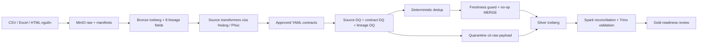

# Audit tích hợp Silver

Ngày: 10/10/2026. Branch: `feat_silver_role2`; giữ working tree hiện có, không commit/push/merge. **Trạng thái: PARTIALLY_COMPLETE.** Phần A đã duyệt code/isolated; sau đó người dùng duyệt có điều kiện B4 duy nhất cho `iceberg.bronze.nso_vietnam`.

Mission finalization đã hoàn thành B1/B2/B3 và **B4_COMPLETE_AND_VERIFIED**: [shared recovery report](nso_b4_shared_recovery_results.md), [shared evidence](nso_b4_shared_validation_evidence.json). Current NSO snapshot `3499764399995403202`, schema 49 fields/833 rows, 21.554 numeric cells và 946 markers; PyIceberg/Trino cell equality và shared rerun NOOP pass. Writer dùng fail-fast/approved nullable-string evolution; repair dùng atomic transaction riêng. ZIP SHA thực `eb2315…`, directory checksum `b4bb…` giữ nguyên.

C1 đã preview lại tám nguồn, counts/schema/lineage/reconciliation khớp baseline; current inventory vẫn 10 Bronze/9 business/0 Silver. C2 có [shared execution plan](silver_shared_execution_plan.md), chưa được duyệt/execute. B4 không đổi [business policies](silver_business_quality_review.md); [NSO contract/unit/province decisions](nso_phase_e_decisions.md) còn chờ duyệt. Chưa POST Spark writer hoặc trigger Airflow task; shared catalog commit duy nhất thuộc NSO Bronze B4, hai DAG vẫn paused.

## Kết quả quan trọng

- REST Catalog thực tế có đúng 10 bảng Bronze: 9 nguồn nghiệp vụ và 1 fixture. Không có namespace/bảng Silver. Business-source coverage đã kiểm chứng live = **0/9 = 0%**.
- Tám nguồn có contract sẵn sàng đã được nối vào cùng controls, preview dữ liệu Bronze thật và kiểm thử Iceberg full/incremental trong warehouse tạm. Điều này không tính là live Silver coverage.
- NSO shared Bronze đã khôi phục geography/year matrix columns, đủ 833 rows và 22.500 non-null cells (21.554 numeric + 946 markers); raw/lineage/history giữ nguyên. Production Silver vẫn blocked bởi contract/unit/province mapping.
- 236 SUA Residuals âm vẫn quarantine theo policy hiện hành. 66 PSD Milling Rate đang quarantine vì nhãn đơn vị trong raw không nhất quán với tên chỉ tiêu. Không sửa dấu hoặc tự chia tỷ lệ.
- Airflow import thành công; hai DAG cùng gọi job/framework chung, có 9 nguồn nghiệp vụ; fixture bị loại khỏi lịch. Chưa trigger task ghi dữ liệu chung.

## Kiến trúc hiện tại

Đường ghi I/V chưa chạy trên catalog dùng chung. `SilverTransformationFramework.prepare` và CLI `--preview` thực thi normalization/contract/DQ/dedup nhưng không tạo namespace, table, quarantine hoặc metadata run.

`BaseSilverTransformer.execute` của Phúc giữ signature và đi qua framework của Hải. Các method transform và class của Phúc tiếp tục được dùng. `deduplicate`/`write_silver` tái dùng merge engine; low-level write API phục vụ caller đã validate, còn production entry points phải dùng `execute`/`framework.run`.

## Vấn đề cũ và thay đổi đã thực hiện

| Trước audit | Sau phần A |
|---|---|
| Hai đường chạy bypass DQ/quarantine | Một framework điều phối; Base.execute delegate |
| Framework chỉ gọi preprocess, bỏ source rules | Gọi transform + source quality_rules + executable contract rules |
| Price/SUA/Trade/WB/Domestic YAML có rule không executable | READY contracts có sql_expr, validator kiểm tra |
| Projection bỏ diagnostics và metadata | Giữ 8 lineage fields, raw payload/value, flags, warnings và derived fields |
| SQL UNKNOWN bị coi là pass | UNKNOWN fail; LOG/KEEP không vào quarantine |
| Negative Trade bị biến NULL; missing keys bị lọc mất | Giữ giá trị gốc và hàng lỗi để DQ xử lý |
| MERGE cập nhật mọi rerun; batch cũ có thể đè mới | No-op không tạo snapshot; timestamp guard; tie bằng file/payload hash |
| Quarantine constructor bỏ qua target; retry cập nhật timestamp | Honor explicit target; dedup batch; giữ record lần đầu nếu errors không đổi |
| Runner/DAG chỉ bốn nguồn, audit PASSED tĩnh | Registry 9 nguồn; DAG query/check thật, không phát READY_FOR_GOLD giả |
| Airflow import phụ thuộc Spark; Spark không mount contracts | Registry không import Spark; mount contracts read-only; job cwd rõ ràng |
| NSO Arrow alignment bỏ cột mới | Schema guard fail trước DELETE/append; không tự replay/evolve bảng cũ |

Không có framework mới, không sửa Gold, không commit/push/merge, không xóa bucket/table/volume. Các YAML được giữ formatting cũ khi bổ sung nội dung, tránh diff không cần thiết.

## Runtime và ranh giới kiểm chứng

Compose đang chạy MinIO/PostgreSQL/REST/Trino/Airflow scheduler/webserver; `spark-iceberg` chưa chạy. Trino báo unhealthy ở healthcheck nhưng SELECT thực tế thành công. Preview sử dụng container Spark tạm trên `tlcn_lakehouse-net`, repo read-only, `local[2]`/2 GB driver. Integration dùng `--network none`, Hadoop warehouse mới dưới `/tmp`.

POST vào Trino chỉ gửi SELECT; PostgreSQL export chỉ SELECT; MinIO chỉ list/get. Evidence lưu [inventory](bronze_inventory_evidence.json), [metadata](ingestion_metadata_evidence.json), [profiles](bronze_profile_evidence.json), [preview](silver_live_preview_evidence.json).

Mọi Bronze `_source_snapshot_id` hiện bằng 0 dù PostgreSQL có 10 source snapshots: đây là lineage reference chưa liên kết. Không dùng số 0 làm Iceberg snapshot. Pipeline pin actual snapshot khi đọc và lưu `_bronze_iceberg_snapshot_id` riêng, đồng thời phát warning. Raw payload không chứa read-time snapshot để rerun qua snapshot mới không đổi identity của observation cũ.

Xem [coverage](bronze_silver_coverage_matrix.md), [DQ/reconciliation](silver_dq_reconciliation_report.md), [test results](silver_integration_test_results.md), [Gold](silver_gold_readiness.md) và [blockers](silver_remaining_blockers.md).
